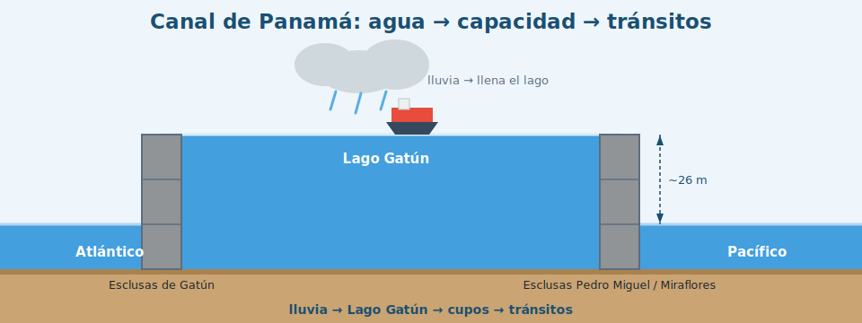

# Análisis de Datos del Canal de Panamá

**Agua → capacidad → tránsitos.** Pipeline de datos + Machine Learning + dashboard
interactivo que cuenta cómo la disponibilidad de agua (lluvia y nivel del Lago
Gatún) condiciona cuántos buques puede cruzar el Canal de Panamá.

<p align="center">
  
</p>

Proyecto académico — UTP, Facultad de Ingeniería de Sistemas Computacionales,
I Semestre 2026 (Grupo 8).

## Inicio rápido

```powershell
git clone https://github.com/eleazarrrg/Canal-de-Panama---Grupo-8.git
cd Canal-de-Panama---Grupo-8
python -m venv .venv
.\.venv\Scripts\Activate.ps1
pip install -r requirements.txt
streamlit run app.py
```

La app abre en http://localhost:8501. Detalle, otros sistemas operativos y la clave
de Gemini (opcional) están en las secciones **9** y **10**.

---

## 1. Tesis del proyecto

El Canal funciona con agua dulce: cada esclusaje vacía agua del Lago Gatún al mar.
Cuando llueve poco, el lago baja y la ACP **reduce los cupos de tránsito diarios**.
Durante la sequía de **2023–2024**, los cupos cayeron de ~36 a ~24 por día y el
volumen de tránsitos se desplomó cerca de **30 %**, recuperándose en la segunda
mitad de 2024.

Todo el análisis y el dashboard giran en torno a esa cadena: **lluvia acumulada →
nivel del lago → capacidad (cupos) → tránsitos**.

---

## 2. Fuentes de datos (2)

| # | Fuente | Tipo | Qué aporta | Realidad |
|---|--------|------|-----------|----------|
| 1 | **Open-Meteo** (Historical Weather API) | API REST, sin key | Lluvia y temperatura diarias en la zona del Lago Gatún (lat 9.18, lon −79.92) | **Datos reales** |
| 2 | **ACP / Portal Logístico de Panamá** | Web scraping | Totales **anuales** de tránsitos por año fiscal (controles) | Real donde se obtiene; ver §6 |

> El detalle **mensual** de tránsitos no está publicado de forma confiable, así que
> se **estima** a partir de los controles anuales reales (ver §6). Cada fila lleva
> una columna `fuente` (`real` / `estimado`) y `clima_fuente` (`openmeteo` /
> `sintetico`).

---

## 3. Pipeline (6 pasos)

```
[Open-Meteo API]                 [ACP / Portal Logístico GT]
  clima real (diario)              tránsitos: controles anuales
       │                                   │
       ▼                                   ▼
 (1) fetch_clima.py            (2) scraper_acp.py ──(falla/cambia)──┐
       │                                   │                        ▼
       │                                   │                 (3) fallback.py
       │                                   │            control anual × estacionalidad
       │                                   │            × CALENDARIO REAL DE CUPOS
       │                                   ▼                        │
       │                          serie mensual estimada ◄─────────┘
       │                                   │
       └──────────► (4) build_dataset.py ◄─┘
                              │
                    data/processed/canal.parquet
                              │
            ┌─────────────────┴──────────────────┐
            ▼                                     ▼
  (5) features.py + train_model.py        (5b) forecast.py
      modelo.pkl, metricas.json,              pronostico.csv
      importancia.csv                         (recursivo + banda)
            └─────────────────┬──────────────────┘
                              ▼
                       (6) app.py  (dashboard Streamlit + resumen LLM)
```

1. **Ingesta de clima** (`fetch_clima.py`): descarga clima diario real de Open-Meteo
   (oct-2014 → may-2026) y lo guarda en `data/raw/clima.csv`.
2. **Ingesta de tránsitos** (`scraper_acp.py`): intenta raspar los totales anuales
   de la ACP/Portal GT; si la estructura cambió o no hay red, lanza una excepción
   controlada y el pipeline usa anclajes públicos documentados.
3. **Serie mensual estimada** (`fallback.py`): reparte cada total anual **real** en
   meses con una estacionalidad suave y el **calendario real de cupos** de la ACP
   (independiente de la lluvia). Marca las filas como `estimado`.
4. **Unión** (`build_dataset.py`): agrega el clima a nivel mensual y lo une con los
   tránsitos por año-mes → `data/processed/canal.parquet`.
5. **ML** (`features.py`, `train_model.py`): features + `RandomForestRegressor` con
   **split temporal**; y `forecast.py` para el pronóstico recursivo con banda.
6. **Dashboard** (`app.py`): 5 páginas + resumen ejecutivo por LLM.

---

## 4. El dashboard

Sidebar con filtros (rango de fechas mensual, tipo de esclusa). Páginas:

1. **Resumen** — KPIs (tránsitos último mes, variación interanual, nivel del lago,
   pronóstico próx. 3 meses) + **resumen ejecutivo por LLM** con botón para regenerar.
2. **Tendencias** — series mensuales de tránsitos y tonelaje CP/SUAB.
3. **Agua vs. Tránsitos** — correlación **lluvia acumulada 12m ↔ tránsitos** (el
   hallazgo central), con la lluvia mensual como contraste y una nota exploratoria
   del rezago.
4. **Mapa** — folium con la infraestructura clave del Canal (Atlántico→Pacífico).
5. **Pronóstico** — proyección FY2026 con intervalo y chequeo *out-of-sample*.

---

## 5. Modelo y resultados

- **Modelo:** `RandomForestRegressor`. **Target:** `transitos_total`
  (= panamax + neopanamax, total oficial ACP por tipo de esclusa).
- **Features:** `mes`, `lluvia_mm`, `lluvia_acum_12m`, `transitos_lag1`,
  `transitos_lag12`.
  - `lluvia_acum_12m` se elige por **mecanismo** (balance hídrico anual del Canal),
    no por maximizar correlación.
  - Sin `anio` (un RandomForest no extrapola años nuevos) y sin `nivel_lago_m`
    (correlaciona con los tránsitos por construcción del respaldo → sería circular).
- **Evaluación:** split temporal, últimos 12 meses (FY2025) como test.
  **MAE ≈ 10.7**, **RMSE ≈ 12.5**, **R² ≈ 0.48** (modesto porque el año de test es
  casi plano; el MAE es la métrica relevante). El modelo gana a la persistencia
  (MAE 13.8) y al estacional (MAE 186).
- **Importancia (tal cual sale):** `lag1` 0.70, `lluvia_acum_12m` 0.20, resto < 0.06.

---

## 6. Estrategia de datos de respaldo (importante)

El pipeline **siempre corre**, haya o no red:

- **Clima:** real de Open-Meteo; si no hay red, se usa una climatología sintética
  (marcada `clima_fuente="sintetico"`).
- **Tránsitos:** los **totales anuales** son reales (FY2024 = 11.240 y FY2025 =
  13.404 = 10.062 panamax + 3.342 neopanamax, verificados; años previos por anclaje
  público). El **detalle mensual** se **estima** repartiendo cada total anual con:
  - una estacionalidad mensual suave, y
  - el **calendario real de cupos diarios** de la ACP (36 normal → 25 en nov-2023 →
    24 → recuperación a 36 en sep-2024).

  La caída de la sequía **no se deriva de la lluvia**: sale del calendario de cupos
  (un evento real, aplicado por fecha). Así, la correlación lluvia↔tránsitos
  **emerge** de dos fuentes independientes (lluvia real + cupos reales que
  ocurrieron en las mismas fechas), en vez de fabricarse.

---

## 7. Honestidad metodológica (léase antes de sacar conclusiones)

- **La correlación es lagueada e integrada, no de mismo mes.** La lluvia *mensual*
  contra tránsitos da r ≈ 0; el agua *acumulada de 12 meses* da **r ≈ 0.43**. Es el
  balance hídrico de ~1 año (vía lago) lo que mueve la capacidad.
- **El nivel del lago es solo contexto**, nunca feature ni "prueba": en el respaldo
  se dibuja del mismo calendario que los cupos, así que correlaciona por construcción.
- **El chequeo del pronóstico (FY2026) es corroboración, no validación de skill.**
  El acumulado oct-2025→may-2026 del pronóstico es **9.063** (base total) frente a
  **8.593** reales de la ACP (base **alto calado**). **No son comparables en nivel**:
  los ~470 de diferencia son la cuota de naves que el conteo de alto calado no
  incluye (**diferencia de base, no error del modelo**). Que coincidan en orden es
  corroboración sobre **un solo período** (n=1, FY2026 estable).
- **La banda del pronóstico (±1.96·RMSE recursivo ≈ ±25) es aproximada y
  probablemente subestima** la incertidumbre real, porque la serie objetivo es
  suave por construcción del respaldo.
- `pdfplumber` no fue necesario (ninguna fuente requirió parsear PDF).

---

## 8. Estructura del repositorio

```
.
├── data/
│   ├── raw/            # crudos por fuente (regenerables; en .gitignore)
│   └── processed/      # canal.parquet (versionado)
├── src/
│   ├── ingesta/        # scraper_acp.py, fetch_clima.py, fallback.py
│   ├── pipeline/       # build_dataset.py
│   ├── ml/             # features.py, train_model.py, forecast.py
│   └── llm/            # resumen.py
├── models/             # modelo.pkl, metricas.json, importancia.csv, pronostico.*
├── app.py              # dashboard Streamlit
├── requirements.txt
├── .gitignore
├── .streamlit/
│   └── secrets.toml    # tu clave de Gemini (NO se versiona; en .gitignore)
└── README.md
```

---

## 9. Instalación y uso local (Windows / PowerShell)

```powershell
# 1) Entorno virtual
python -m venv .venv
.\.venv\Scripts\Activate.ps1

# 2) Dependencias
pip install -r requirements.txt

# 3) (Opcional) Regenerar todo el pipeline desde cero
python src\pipeline\build_dataset.py   # -> data/processed/canal.parquet
python src\ml\train_model.py           # -> models/modelo.pkl, metricas.json, importancia.csv
python src\ml\forecast.py              # -> models/pronostico.csv, pronostico.json

# 4) Levantar el dashboard
streamlit run app.py
```

En Linux/Mac, el paso 1 es `source .venv/bin/activate` y las rutas usan `/`.

> Los artefactos (`canal.parquet` y `models/`) ya vienen versionados, así que el
> paso 3 es **opcional**: la app corre directamente con `streamlit run app.py`.

---

## 10. Configurar la API key (Gemini, opcional)

El resumen ejecutivo usa **Gemini** vía el SDK `google-genai`. Es **opcional**.
Creá el archivo `.streamlit/secrets.toml` (NO se versiona, está en `.gitignore`) con:

```toml
GEMINI_API_KEY = "tu-clave-de-google-ai-studio"
```

Conseguí una clave gratis en https://aistudio.google.com/apikey.
**Sin clave la app no se cae:** el resumen se genera con una plantilla local a
partir de las mismas cifras (degradación). La capa LLM (`src/llm/resumen.py`) está
desacoplada del proveedor, así que cambiarlo es trivial.

---

## 11. Despliegue en Streamlit Community Cloud

1. Subí el repo a GitHub (con `canal.parquet` y `models/` versionados).
2. En https://share.streamlit.io → **New app**, elegí el repo y la rama.
3. **Main file path:** `app.py`.
4. (Opcional) **Advanced settings → Secrets:** pegá
   `GEMINI_API_KEY = "tu-clave"`.
5. **Deploy.** Streamlit instala `requirements.txt` y corre `app.py`. Como los
   datos y el modelo están versionados, **no necesita correr el pipeline ni red**
   (salvo que uses Gemini).

---

## 12. Limitaciones

- El detalle **mensual** de tránsitos es estimado (los totales anuales son reales).
- El episodio de sequía analizado es **uno** (n=1): la relación agua↔tránsitos está
  bien fundamentada pero no se puede afirmar *skill* general de pronóstico.
- La banda del pronóstico subestima la incertidumbre real (serie suave).
- El scraper depende de la estructura de sitios públicos que pueden cambiar; por eso
  existe el respaldo.

---

## 13. Créditos

**Grupo 8** — UTP, Facultad de Ingeniería de Sistemas Computacionales,
I Semestre 2026.

| Integrante | Cédula | Responsabilidad principal |
|---|---|---|
| Juan Zhu | 8-XXXX-XXXX | Ingesta de datos (clima, scraper, respaldo) |
| Alex de Boutaud | 8-XXXX-XXXX | Pipeline y construcción del dataset |
| Jeremy Martínez | 8-XXXX-XXXX | Machine Learning (modelo y pronóstico) |
| Rafael Gómez | 8-XXXX-XXXX | Dashboard (Streamlit, mapa, gráficas) |
| Octavio Frauca | 8-XXXX-XXXX | IA (resumen Gemini), documentación y despliegue |

> Reemplacen `8-XXXX-XXXX` por la cédula real editando este archivo. (No las dejo
> escritas automáticamente por ser datos personales; al ser el repositorio privado,
> pueden completarlas con seguridad.)
